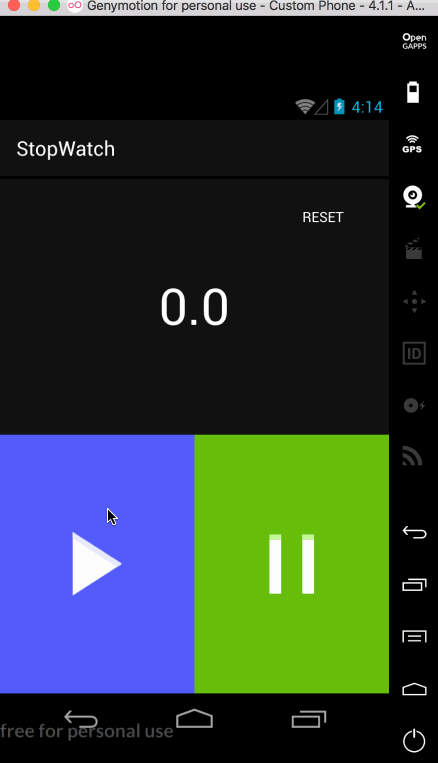

# 30DaysOfAndroid

Thx for [30DaysofSwift](https://github.com/allenwong/30DaysofSwift)

First, I'm a iOS developer.

There is a recent demand for android development.

I plan to start learning android develop.

So just do 30DaysOfAndroid !

Thx again for the inspiration [30DaysofSwift](https://github.com/allenwong/30DaysofSwift) gave me

**[Project 01 - SimpleStopWatch](https://github.com/HeathHsia/30DaysOfAndroid/tree/master/Project%2001%20-%20SimpleStopWatch)**

**[Project 02 - CustomFont](https://github.com/HeathHsia/30DaysOfAndroid/tree/master/Project%2002%20-%20CustomFont)**

**[Project 03 - PlayLocalVideo](https://github.com/HeathHsia/30DaysOfAndroid/tree/master/Project%2003%20-%20PlayLocalVideo)**

**[Project 04 - SnapChatMenu](https://github.com/HeathHsia/30DaysOfAndroid/tree/master/Project%2004%20-%20SnapChatMenu)**

**[Project 05 - CarouselEffect](https://github.com/HeathHsia/30DaysOfAndroid/tree/master/Project%2005%20-%20CarouselEffect)**

**[Project 06 - FindMyLocation](https://github.com/HeathHsia/30DaysOfAndroid/tree/master/Project%2006%20-%20FindMyLocation)**

**[Project 07 - PullToRefresh](https://github.com/HeathHsia/30DaysOfAndroid/tree/master/Project%2007%20-%20PullToRefresh)**

**[Project 08 - RandomGradientColorMusic](https://github.com/HeathHsia/30DaysOfAndroid/tree/master/Project%2008%20-%20RandomGradientColorMusic)**

**[Project 09 - ImageScroller](https://github.com/HeathHsia/30DaysOfAndroid/tree/master/Project%2008%20-%20RandomGradientColorMusic)**

**[Project 10 - VideoBackground](https://github.com/HeathHsia/30DaysOfAndroid/tree/master/Project%2008%20-%20RandomGradientColorMusic)**

